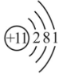

## [2-1]钠单质+钠的氧化物
### 钠元素

#### 1.自然界存在：

钠元素在自然界中都以化合物的形式存在。

#### 2、钠的原子结构示意图

由此可知钠原子容易失去1个电子，达到最外层8电子的稳定结构。因此Na元素的稳定化合价为+1价，由此也可推出金属钠易失电子，具有强还原性。

### 钠元素的性质

#### 1.物理性质：

在常温下，金属钠为银白色具有金属光泽的固体，质软，熔点低，密度小于水但大于煤油。

#### 2.化学性质：

根据钠原子结构示意图可知，钠元素的稳价是+1价，所以金属钠(0价)体现极强的还原性，能与绝大多数的氧化剂反应。

(1)与非金属单质的反应
① 与氧气反应

$$
\begin{cases}
4\text{Na} + \text{O}_{2} = 2\text{Na}_{2}\text{O} \quad (\text{白色}) \\
2\text{Na} + \text{O}_{2} \overset{\Delta}{=} \text{Na}_{2}\text{O}_{2} \quad (\text{淡黄色})
\end{cases}
$$

注：i.钠投入坩埚中，受热后先熔化，再燃烧（说明Na的熔点低于着火点）。燃烧时发出黄色火焰，释放大量的热（放热反应），生成淡黄色固体。
ii.这两个反应体现了温度的量变引起质变。铁与氧气的反应也存在温度的量变引起质变，铁在纯氧中燃烧生成黑色的$\text{Fe}_{3}\text{O}_{4}$，在常温下缓慢氧化生成$\text{Fe}_{2}\text{O}_{3}$。

② $\text{X}_2$($\text{F}_2$、$\text{Cl}_2$、$\text{Br}_2$、$\text{I}_2$)：

$$
2\text{Na} + \text{X}_2 \overset{\Delta}{=} 2\text{NaX}
$$

注：钠既可以在$\text{O}_2$中燃烧，又可以在$\text{Cl}_2$中燃烧。由此可知，可燃物与氧化剂(或助燃剂)发生剧烈的发光发热的化学反应叫作燃烧反应。燃烧反应不一定有$\text{O}_2$参与。

(2) 与化合物的反应

<table>
  <tr >
    <td>①与水(滴有酚酞)</td>
    <td colspan="2">化学方程式：$2\text{Na} + 2\text{H}_2\text{O} = 2\text{NaOH} + \text{H}_2 \uparrow$ 离子方程式：$2\text{Na} + 2\text{H}_2\text{O} = 2\text{Na}^+ + 2\text{OH}^- + \text{H}_2 \uparrow$ (现象及解释：浮—$\rho(\text{H}_2\text{O}) > \rho(\text{Na})$；熔—反应放热，且 Na 的熔点低；游—反应产生气体；响—反应剧烈；红—生成碱性物质) 钠与水反应的本质即钠与水电离出的 $\text{H}^+$ 反应</td>
  </tr>
  <tr>
    <td>②与强酸</td>
    <td colspan="2">$2\text{Na} + 2\text{H}^+ = 2\text{Na}^+ + \text{H}_2 \uparrow$ 钠与酸反应的剧烈程度大于钠与水的反应</td>
  </tr>
  <tr>
    <td  rowspan="2">③与盐</td>
    <td>水环境 (以 $\text{CuSO}_4$ 溶液为例)</td>
    <td>$2\text{Na} + 2\text{H}_2\text{O} + \text{CuSO}_4 = \text{Na}_2\text{SO}_4 + \text{H}_2 \uparrow + \text{Cu(OH)}_2 \downarrow$ $2\text{Na} + 2\text{H}_2\text{O} + \text{Cu}^{2+} = 2\text{Na}^+ + \text{H}_2 \uparrow + \text{Cu(OH)}_2 \downarrow$ 现象：浮、熔、游、响、蓝(生成蓝色絮状沉淀)</td>
  </tr>
  <tr>
    <td>非水环境 (以熔融 $\text{TiCl}_4$ 为例)</td>
    <td>$4\text{Na} + \text{TiCl}_4 \overset{\text{高温}}{=} 4\text{NaCl} + \text{Ti}$</td>
  </tr>
  </tr>
</table>

#### 3.用途

(1) 钠钾合金可用于核反应堆的传热介质，该用途利用了钠钾合金熔点低，沸点高，且导热能力好的性质。
(2) 用作电光源，制作高压钠灯。该用途利用了钠在高压下能发出具有很强穿透性的黄光。
(3) 冶炼金属
①金属钠具有强还原性，熔融状态下可以用于制取金属，如$4\text{Na} + \text{TiCl}_4 \overset{\text{高温}}{=} 4\text{NaCl} + \text{Ti}$。
②金属钠的沸点高于金属钾，控制温度(K的沸点<反应温度<钠的沸点):$\text{Na} + \text{KCl} \overset{\text{高温}}{=} \text{K} \uparrow + \text{NaCl}$。

#### 4.制备

$$
2\text{NaCl}(\text{熔融}) \overset{\text{电解}}{=} 2\text{Na} + \text{Cl}_2 \uparrow
$$

注：电解$\text{NaCl}$水溶液不能获得金属钠，因为水电离的$\text{H}^+$其氧化性强于$\text{Na}^+$(或钠单质与水要反应，水中不可能有金属钠)。

5.保存
密封保存在煤油中。钠着火，不能用水或泡沫灭火器灭火，应该用专用灭火剂或干燥的沙土灭火。

### $\text{Na}_2\text{O}$和$\text{Na}_2\text{O}_2$

#### 1.$\text{Na}_2\text{O}$和$\text{Na}_2\text{O}_2$的对比

<table>
 <thead>
 <tr>
 <td colspan="2">物质</td>
 <td>氧化钠$(\text{Na}_2\text{O})$</td>
 <td>过氧化钠$(\text{Na}_2\text{O}_2)$</td>
 </tr>
 </thead>
 <tbody>
 <tr>
 <td colspan="2">颜色、状态</td>
 <td>白色固体</td>
 <td>淡黄色固体</td>
 </tr>
 <tr>
 <td colspan="2">类别</td>
 <td>碱性氧化物</td>
 <td>过氧化物(不是碱性氧化物)</td>
 </tr>
 <tr>
 <td colspan="2">氧的价态</td>
 <td>−2(稳价)</td>
 <td>−1(非稳价)</td>
 </tr>
 <tr>
 <td colspan="2">阴、阳离子个数比</td>
 <td>$1(\text{O}^{2-})$∶$2(\text{Na}^+)$</td>
 <td>$1(\text{O}_2^{2-})$∶$2(\text{Na}^+)$</td>
 </tr>
 <tr>
 <td colspan="2">主要化学性质</td>
 <td>碱性氧化物的通性</td>
 <td>既有氧化性(强)，又有还原性(弱)</td>
 </tr>
 <tr>
 <td rowspan="3">常见反应</td>
 <td>与水</td>
 <td>$\text{Na}_2\text{O} + \text{H}_2\text{O} = 2\text{Na}^+ + 2\text{OH}^-$</td>
 <td>$2\text{Na}_2\text{O}_2 + 2\text{H}_2\text{O} = 4\text{Na}^+ + 4\text{OH}^- + \text{O}_2\uparrow$</td>
 </tr>
 <tr>
 <td>与 $\text{C}\text{O}_2$</td>
 <td>$\text{Na}_2\text{O} + \text{CO}_2 = \text{Na}_2\text{CO}_3$</td>
 <td>$2\text{Na}_2\text{O}_2 + 2\text{CO}_2 = 2\text{Na}_2\text{CO}_3 + \text{O}_2$</td>
 </tr>
 <tr>
 <td>与硫酸</td>
 <td>$\text{Na}_2\text{O} + 2\text{H}^+ = 2\text{Na}^+ + \text{H}_2\text{O}$</td>
 <td>$2\text{Na}_2\text{O}_2 + 4\text{H}^+ = 4\text{Na}^+ + 2\text{H}_2\text{O} + \text{O}_2\uparrow$</td>
 </tr>
 <tr>
 <td>转化</td>
 <td colspan="4">$$2\text{Na}_2\text{O} + \text{O}_2 \overset{\Delta}{=} 2\text{Na}_2\text{O}_2$$</td>
 </tr>
 <tr>
 <td colspan="2">主要用途</td>
 <td>用于制取少量烧碱</td>
 <td>强氧化剂、漂白剂、消毒剂、供氧剂</td>
 </tr>
 </tbody>
</table>

注：$\text{Na}_2\text{O}_2$中$\text{O}$的化合价为$-1$价，是$\text{O}$的中间价态，$\text{Na}_2\text{O}_2$既有氧化性，又有还原性；由于$\text{O}$的稳价为$-2$价，所以$\text{Na}_2\text{O}_2$主要体现强氧化性。但物质在化学变化中具体体现什么性质，除了跟自己本身的性质有关外，还要看其反应对象的性质。若$\text{Na}_2\text{O}_2$遇到稳价的$\text{H}_2\text{O}$、$\text{CO}_2$等，$\text{Na}_2\text{O}_2$发生歧化反应；$\text{Na}_2\text{O}_2$遇强还原剂：$\text{H}_2\text{S}$、$\text{SO}_2$、$\text{HI}$等，$\text{Na}_2\text{O}_2$中的$\text{O}$被还原成$-2$价；$\text{Na}_2\text{O}_2$遇强氧化剂：酸性$\text{KMnO}_4$，$\text{Na}_2\text{O}_2$中的$\text{O}$被氧化成$\text{O}_2$。常考的过氧化物有$\text{H}_2\text{O}_2$、$\text{Na}_2\text{O}_2$、$\text{CaO}_2$、过氧乙酸($\text{CH}_3\text{COOOH}$)、过碳酸钠($\text{Na}_2\text{CO}_3\cdot\text{H}_2\text{O}_2$)等。

#### 2.漂白性的归纳与总结

<table><tr><td>定义</td><td  colspan="2">物质与色素(如品红、石蕊等)作用,使其褪色的性质</td></tr><tbody><tr><td>分类</td><td>物理变化</td><td>化学变化</td></tr><tr><td></td><td>吸附漂白</td><td>氧化漂白</td></tr><tr><td>代表物质</td><td>活性炭</td><td>$\text{H}\text{Cl}\text{O}$、$\text{H}_2\text{O}_2$</td></tr><tr><td>漂白对象</td><td>大多数色素</td><td>大多数色素</td></tr></tbody></table>

#### 3.类比和对比方法的合理使用

$\text{Na}_2\text{O}_2$与稳定的酸性氧化物$\text{CO}_2$发生歧化反应(氧元素化合价变化遵循“邻价”规律)，产物有$\text{O}_2$，该反应中每消耗1份$\text{Na}_2\text{O}_2$转移1份电子。但$\text{Na}_2\text{O}_2$与同样是酸性氧化物的$\text{SO}_2$发生的却是一般氧化还原反应(氧元素化合价变化遵循稳价规律)，产物没有$\text{O}_2$，该反应中每消耗1份$\text{Na}_2\text{O}_2$转移2份电子；因为$\text{SO}_2$有强还原性。由此可知，学习元素化合物的性质时，不仅要利用“类比法”，也要使用“对比法”。
